# Autoregressive Flow models and RealNVP in PyTorch
PyTorch implementations of Autoregressive Flows and RealNVP for both 2D and 3D datasets.

## Models

**Autoregressive Flow:**

In an autoregressive flow, we learn the transformation . The log-likelihood is then  because the Jacobian is triangular. For each dimension, use the CDF of a mixture of Gaussians or Logistics to map to the latent space, which should be  i.i.d..

Fit   with maximum likelihood via stochastic gradient descent on the training set. Since this is a 2D problem, you can either learn  and  together with a MADE model, or with separate networks.

**RealNVP (2D):**

In this part, we want to train a flow with the following structure: 
, where each  is an affine transformation of 1 dimension, conditioned on the other, and . According to [Density Estimation Using Real NVP](https://arxiv.org/abs/1605.08803) Section 4.1, there's a particularly good way to parameterize the affine transformation:

Assuming that we're conditioning on  and transforming , we have 

- 

- 

- 

where , , and  are all learned parameters.

**Autoregressive Flows using PixelCNN:**

Using the PixelCNN from previous [project](https://github.com/henrhoi/pixelcnn-pytorch) and using it as an autoregressive flow model on the black-and-white shapes dataset. Remember to dequantize the data and scale it between 0 and 1 for the autoregressive flow to have stable training.

**RealNVP (3D):**

Using the affine coupling flow from RealNVP and a form of [data-dependent initialization](https://arxiv.org/abs/1602.07868) that normalizes activations from an initial forward pass with a minibatch.

## Datasets

| Name | Dataset |
|------|---------|
| Smiley     |  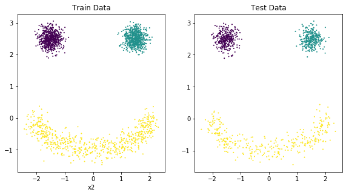       |
| Half Moons     |  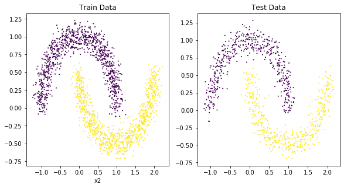       |
| Shapes     |  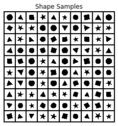       |
| CelebA     |  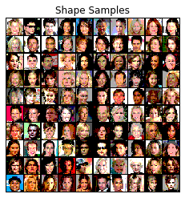       |

## Results and samples

| Model | Dataset | Densities |  Latent space | 
|------|---------|---------|---------|
| AR Flow   | Smiley  |         | 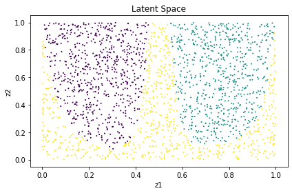|
| AR Flow  | Half Moons  | 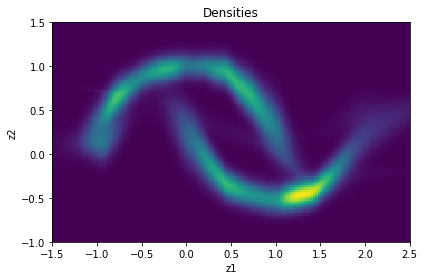  | 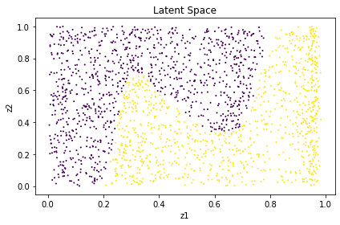 | 
| RealNVP (2D) | Smiley    |  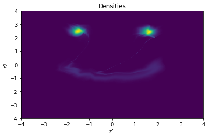       |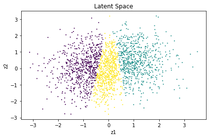 |
| RealNVP (2D) | Half Moons    |  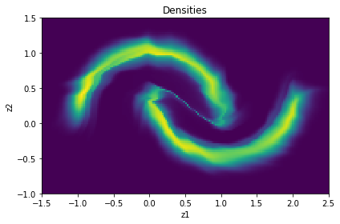       |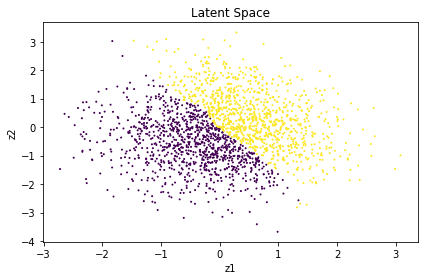 |

| Model | Dataset | Samples | Additional samples |
|------|---------|---------|---------|
| AR Flow w/ PixelCNN | Shapes    |  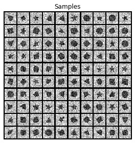       |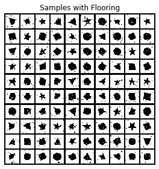 |
| RealNVP (3D) | CelebA    |  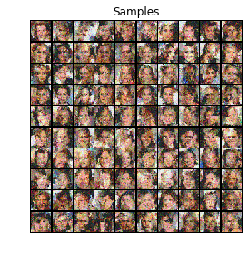       | 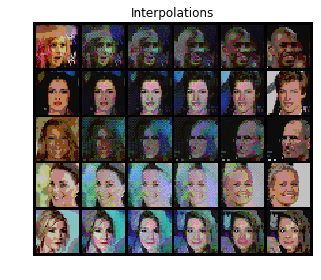 |

